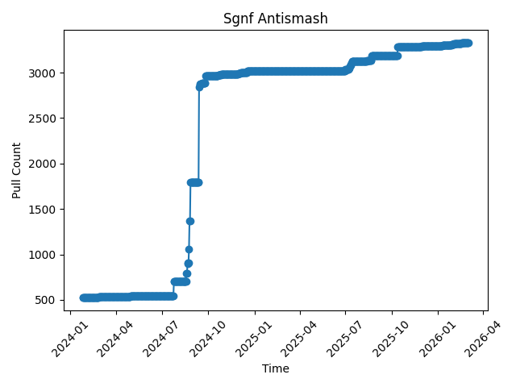
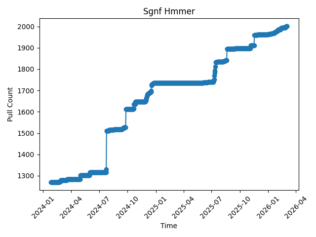
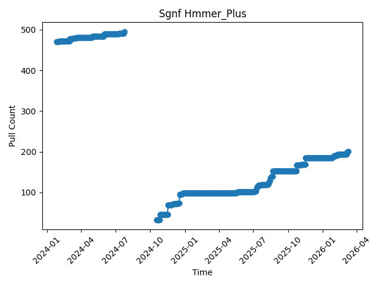
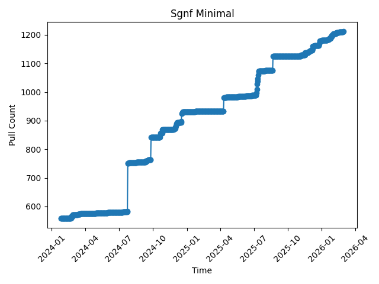
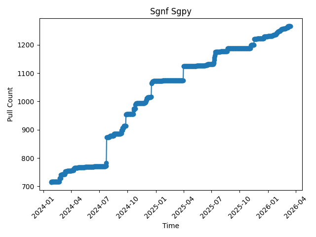

This repo counts the number of Docker container image downloads for the SocialGene Nextflow pipeline images.

https://github.com/socialgene/sgnf?tab=readme-ov-file#docker-images

## Pull Count Plots

### Sgnf Antismash

### Sgnf Hmmer

### Sgnf Hmmer_plus

### Sgnf Minimal

### Sgnf Sgpy

